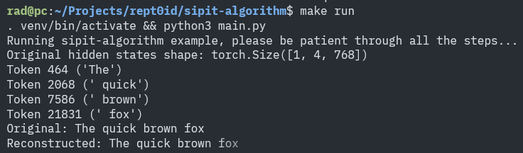

# sipit-algorithm



> Disclaimer :
>
> This implementation is for **educational and research purposes only**. The SIPIT algorithm is the intellectual property of its authors, and this repository does not claim any rights over the algorithm itself.

This repository provides an implementation of the **SIPIT algorithm**, as described in the paper:
> *"Language Models Are Injective and Hence Invertible"* (Giorgos Nikolaou, Tommaso Mencattini, Donato Crisostomi, Andrea Santilli, Yannis Panagakis, Emanuele Rodolà) [[1]](#links).

The SIPIT algorithm leverages the **injective property** of large language models (LLMs): given a distinct input, an LLM produces a distinct output.

By treating LLMs as **1-1 functions**, SIPIT efficiently reverses the output back to the input, in such an efficient way -compared to raw brute-force methods- that makes it doable with commodity hardware.

This enables opportunities such as:
- **Input recovery** from model outputs.
- **Privacy and security analysis** of LLM-generated content.
- **Model interpretability** and inversion studies.

## How to Use

### Install Dependencies
```
  make install
```

### Run
```
  make run
```

# Links
1. https://arxiv.org/pdf/2510.15511
